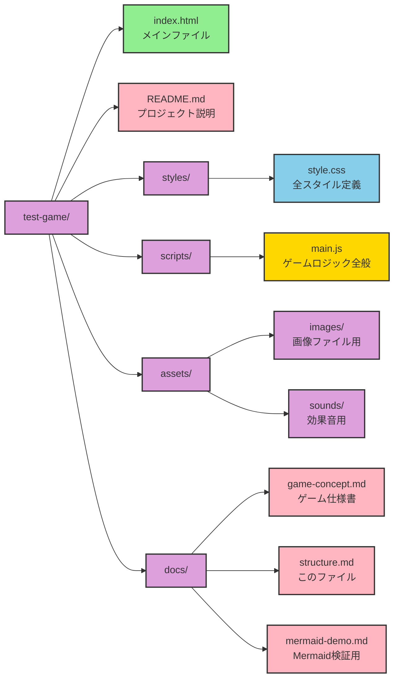

# プロジェクト構成

## 現在のフォルダ構成

## ファイルの役割

### 📁 ルートディレクトリ
- **index.html**: ゲームのエントリーポイント（HTML構造のみ）
- **README.md**: GitHubで表示されるプロジェクト説明

### 📁 styles/
- **style.css**: ログイン画面・ゲーム画面の全スタイル定義

### 📁 scripts/
- **main.js**: ゲームロジック、画面制御、セーブ機能など全般
  - 将来的に膨大になったら機能別に分割予定

### 📁 assets/
- **images/**: ゲーム内で使用する画像（将来実装用）
- **sounds/**: 効果音ファイル（将来実装用）

### 📁 docs/
- **game-concept.md**: ゲームの完全仕様書
- **structure.md**: このファイル（プロジェクト構成管理）
- **mermaid-demo.md**: Mermaid記法の技術検証

## 開発方針
1. まずはシンプルに保つ（ファイル数を最小限に）
2. コードが膨大になってきたら適切に分割
3. CSSとJavaScriptは外部ファイル化して見通しを良くする
4. assetsフォルダは将来の拡張に備えて準備
